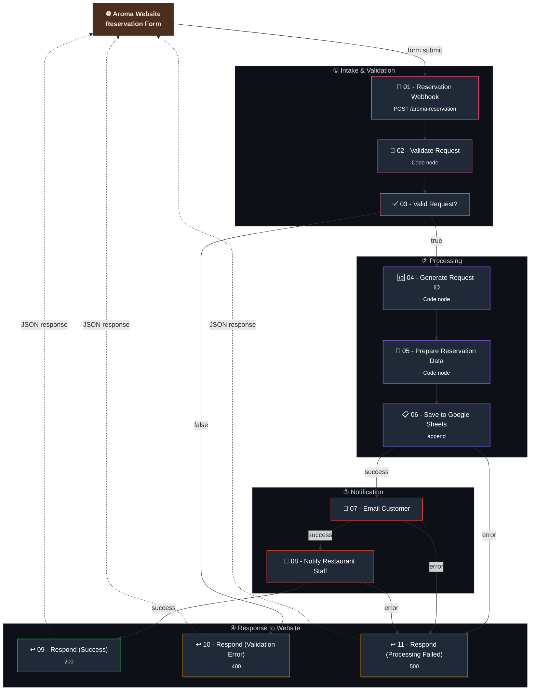

# ☕ Aroma Coffee & Tea Co. — Reservation Request System
 
**A full-stack reservation request pipeline: a custom-built restaurant website that captures table requests and hands them off to an n8n backend for validation, logging, and two-sided email notification.**
 
This is a portfolio demo built end-to-end: a real front-end reservation form, a webhook-driven n8n automation backend, structured request tracking in Google Sheets, and branded HTML email confirmations for both the guest and the restaurant staff.
 

  
  
  
  
  
  

---

## 📌 Overview
 
**Aroma** is a fictional café built as a portfolio demo, with a real reservation form on its website. When a guest submits the form, it sends a `POST` request to an n8n webhook, which:
 
1. Validates every field server-side (not just in the browser).
2. Generates a unique, human-readable **Request ID**.
3. Formats the reservation into clean, display-ready values.
4. Appends the full request to a **Google Sheet** acting as the restaurant's request log.
5. Emails the **guest** a branded confirmation that their request was received (not yet confirmed).
6. Emails the **restaurant staff** the full reservation details so they can follow up and confirm availability.
7. Returns a clear JSON response back to the website so the front end can show a success or error state.

Unlike a simple "form → spreadsheet" integration, this workflow treats every reservation as a **request that must be manually confirmed** by the restaurant — mirroring how most real independent restaurants actually operate.
 
---

## ✨ Features
 
- 🧾 **Server-side validation** — every field (name, email format, phone, date, time, guest count, seating preference) is validated inside the workflow itself, not just trusted from the browser form.
- 🆔 **Human-readable Request IDs** — auto-generated IDs like `AR-20260910-3F2A` make it easy for staff to reference a specific request in conversation or email.
- 📋 **Structured request log** — every reservation, valid or not, is captured with a consistent schema (name, contact info, date/time, party size, seating preference, special requests, source, and status) in Google Sheets.
- 📧 **Dual HTML email notifications** — a branded confirmation email to the guest, and a separate staff-facing summary email, each with its own tailored template.
- 🚦 **Explicit "Pending Confirmation" status** — every new request is clearly marked as unconfirmed, both in the spreadsheet and in the guest-facing email, avoiding false expectations.
- 🔁 **Three distinct response paths** — success, validation error, and processing failure are each handled with their own dedicated response node and correct HTTP status code.
- 🌐 **Decoupled front end** — the workflow only cares about receiving a well-formed JSON payload, so any website, form builder, or app can act as the front end.
---
 
## 🗺️ Workflow Architecture
 

 
> 📖 For a deeper technical breakdown, see [docs/workflow-architecture.md](./docs/workflow-architecture.md).
 
---
 
## 🧩 Node-by-Node Breakdown
 
| # | Node | Type | Purpose |
|---|---|---|---|
| 1 | **01 - Reservation Webhook** | `n8n-nodes-base.webhook` | Entry point. Listens for `POST` requests at `/aroma-reservation` sent by the website's reservation form. |
| 2 | **02 - Validate Request** | `n8n-nodes-base.code` | Server-side validation of every field — required fields, email format, positive guest count, and an allow-list of seating preferences. Produces a clean `isValid` flag and normalized fields. |
| 3 | **03 - Valid Request?** | `n8n-nodes-base.if` | Branches the workflow based on the `isValid` flag from the previous step. |
| 4 | **04 - Generate Request ID** | `n8n-nodes-base.code` | Builds a unique, human-readable Request ID (e.g. `AR-20260910-3F2A`) and sets the initial status to `Pending Confirmation`. |
| 5 | **05 - Prepare Reservation Data** | `n8n-nodes-base.code` | Converts the raw date/time into friendly display strings (e.g. `September 10, 2026`, `12:00 PM`) for use in the emails and spreadsheet. |
| 6 | **06 - Save to Google Sheets** | `n8n-nodes-base.googleSheets` (`append`) | Appends the fully processed reservation as a new row in the restaurant's request-tracking spreadsheet. |
| 7 | **07 - Email Customer** | `n8n-nodes-base.emailSend` | Sends a branded HTML confirmation email to the guest, summarizing their request and clearly marking it as pending. |
| 8 | **08 - Notify Restaurant Staff** | `n8n-nodes-base.emailSend` | Sends a separate staff-facing HTML email with the full reservation details, formatted for quick review. |
| 9 | **09 - Respond to Website (Success)** | `n8n-nodes-base.respondToWebhook` | Returns a `200` JSON response confirming the request was received, including the Request ID. |
| 10 | **10 - Respond to Website (Validation Error)** | `n8n-nodes-base.respondToWebhook` | Returns a `400` JSON response with a human-readable error message when validation fails. |
| 11 | **11 - Respond to Website (Processing Failed)** | `n8n-nodes-base.respondToWebhook` | Returns a `500` JSON response if the Sheets write or either email send fails after validation passed. |
 
> 📖 For full field-by-field code and logic details, see [docs/codenode.md](./docs/codenode.md).
 
---

## 🛡️ Error Handling Design
 
- **Validation is a hard gate.** Malformed submissions never reach Google Sheets or trigger any email — they're rejected immediately at node `03` with a `400` response and a specific error message.
- **Every downstream node has an error branch.** The Google Sheets write and both email-send nodes each route their `error` output to the same `11 - Respond to Website (Processing Failed)` node, so any mid-pipeline failure still returns a clean, predictable `500` response to the website instead of hanging or crashing silently.
- **The website always gets an answer.** All three outcomes — success, validation error, and processing failure — are handled by a dedicated `Respond to Webhook` node with the correct HTTP status code, so the front end can reliably branch its UI (success message vs. inline form errors vs. generic failure message).
---
 
## ✅ Prerequisites & Setup
 
- An **n8n instance** (Cloud or self-hosted).
- A **Google account** with access to Google Sheets and a spreadsheet configured for request logging.
- An **SMTP-capable email account** (or n8n-supported email credential) for sending both the customer and staff notifications.
- A **website or form** capable of submitting a `POST` request with a JSON body to the workflow's webhook URL (this repo includes the Aroma demo site's expected field names).
📎 Full step-by-step setup: [docs/installation.md](./docs/installation.md)
🔑 Full credential and field configuration: [docs/configuration.md](./docs/configuration.md)
 
---
## 🚀 How to Import & Run
 
1. Clone this repository and import `aroma-reservation-workflow.json` into n8n.
2. Connect your Google Sheets and email credentials.
3. Point your website's reservation form to the workflow's webhook URL.
4. Activate the workflow and submit a test reservation.
Full walkthrough: [docs/installation.md](./docs/installation.md)
 
---

## 📖 Documentation
 
| Doc | Covers |
|---|---|
| [docs/installation.md](./docs/installation.md) | Step-by-step setup from import to activation |
| [docs/configuration.md](./docs/configuration.md) | Every credential, field, and environment setting |
| [docs/workflow-architecture.md](./docs/workflow-architecture.md) | Deep technical breakdown of the full pipeline |
| [docs/codenode.md](./docs/codenode.md) | Full explanation of the JavaScript inside each Code node |
| [docs/workflow-guide.md](./docs/workflow-guide.md) | How to use, test, and extend the workflow day-to-day |
 
---

## 📸 Screenshots 

 ### Actuall Automation Workflow :

### Arom Reservation website:

### Request Table :

### Request submitted :

### Aroma Googlesheet :

## 🔮 Future Improvements
 
- ✅ **Staff confirmation loop** — add a simple staff-facing "Confirm / Decline" action (email button or small internal form) that updates the Google Sheets status and triggers a follow-up email to the guest.
- 📅 **Calendar/availability check** — cross-reference requested date/time against a real booking calendar before accepting a request, instead of accepting all requests as pending.
- 🔁 **Duplicate-request detection** — detect and flag repeated submissions from the same guest for the same date/time.
- 📊 **Daily digest for staff** — a scheduled workflow that emails staff a daily summary of all pending requests instead of one email per request.
- 🌍 **Multi-language guest emails** — detect the guest's browser language and send the confirmation email accordingly.
- 🔐 **Webhook authentication** — add a shared secret / signature check so the webhook only accepts requests genuinely originating from the Aroma website.
- 🧪 **Automated evaluation pipeline** — use n8n's Evaluations tab to regression-test the validation logic against a set of known-good and known-bad payloads.
---
## 📄 License
 
This project is licensed under the [MIT License](LICENSE).
 
---
 
## 🙋‍♂️ Author
 
Built and maintained by **[@buildwithareel](https://github.com/buildwithareel)** — exploring AI automation, agentic workflows, and n8n-based systems.
 