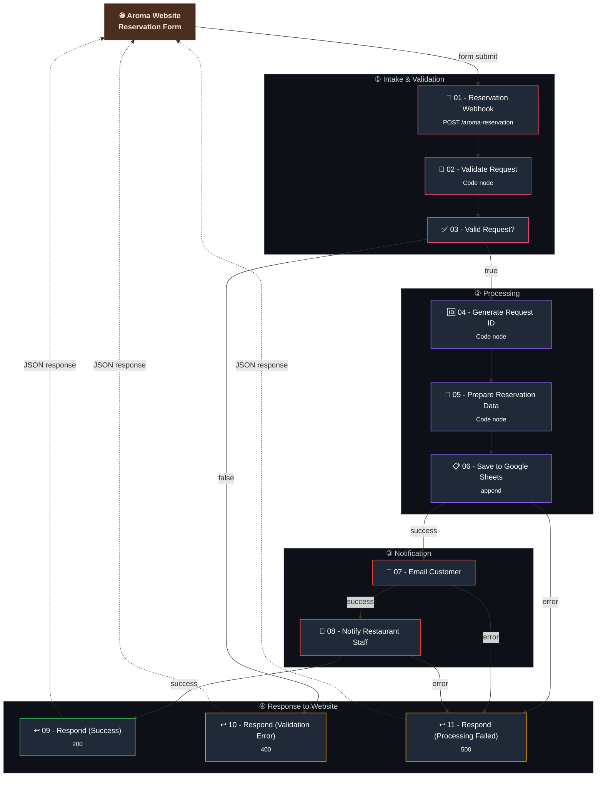

# 🗺️ Workflow Architecture

A deep technical breakdown of how the **Aroma Coffee & Tea Co.** reservation pipeline processes a request from website submission to dual-email confirmation.

> 📖 For a high-level summary, see the [main README](../README.md#-workflow-architecture).

---

## 1. Full Diagram



<details>
<summary><strong>📄 Prefer a plain-text view?</strong> (click to expand)</summary>

```
Aroma Website Form
        │  POST /aroma-reservation
        ▼
01 - Reservation Webhook
        ▼
02 - Validate Request  (server-side checks)
        ▼
03 - Valid Request? ──(false)──▶ 10 - Respond (400 Validation Error)
        │ (true)
        ▼
04 - Generate Request ID  (e.g. AR-20260910-3F2A)
        ▼
05 - Prepare Reservation Data  (friendly date/time strings)
        ▼
06 - Save to Google Sheets ──(error)──▶ 11 - Respond (500 Processing Failed)
        │ (success)
        ▼
07 - Email Customer ──(error)──▶ 11 - Respond (500 Processing Failed)
        │ (success)
        ▼
08 - Notify Restaurant Staff ──(error)──▶ 11 - Respond (500 Processing Failed)
        │ (success)
        ▼
09 - Respond (200 Success, with Request ID)
```

</details>

---

## 2. Execution Phases

### Phase ① — Intake & Validation
Receives the raw webhook payload and rejects anything malformed **before** any data is written or any email is sent. This is a hard gate — invalid requests never reach Phase ②.

### Phase ② — Processing
Turns a validated request into a fully-formed, uniquely identified reservation record, and persists it to Google Sheets as the system of record.

### Phase ③ — Notification
Sends two independently templated HTML emails — one to the guest, one to staff — each surfacing the information that audience actually needs.

### Phase ④ — Response to Website
Every possible outcome (success, validation failure, processing failure) is translated into a predictable JSON response with the correct HTTP status code, so the front end can reliably render the right UI state.

---

## 3. Node-by-Node Technical Reference

### 3.1 `01 - Reservation Webhook`
- **Type:** `n8n-nodes-base.webhook`
- **Method / Path:** `POST /aroma-reservation`
- **Response Mode:** `responseNode` — meaning this node does **not** auto-respond; the actual HTTP response is sent later by whichever of nodes `09`/`10`/`11` the execution reaches.
- **Role:** Single entry point for all reservation submissions from the website.

### 3.2 `02 - Validate Request`
- **Type:** `n8n-nodes-base.code`
- **Role:** Performs full server-side validation, independent of whatever validation the website's form already does client-side.
- **Logic summary:**
  - Reads from `$input.first().json.body` (falls back to the raw JSON if `body` isn't present).
  - Trims and normalizes every field into consistent types (strings trimmed, `guests` coerced to a `Number`).
  - Validates: `guestName` non-empty, `email` matches a standard regex, `phone` non-empty, `date` non-empty, `time` non-empty, `guests` is a positive number, `seatingPreference` is one of `Indoor` / `Patio` / `No Preference`.
  - Defaults `specialRequests` to `"None"` and `source` to `"Aroma Reservation Demo"` when omitted.
  - Outputs a single item containing `isValid` (boolean), `errorMessage` (all validation errors joined into one string), and every normalized field.

### 3.3 `03 - Valid Request?`
- **Type:** `n8n-nodes-base.if`
- **Condition:** `{{$json.isValid}} === true` (strict boolean check).
- **True branch →** Phase ② (processing continues).
- **False branch →** `10 - Respond to Website (Validation Error)` (short-circuits immediately, skipping all processing and notification).

### 3.4 `04 - Generate Request ID`
- **Type:** `n8n-nodes-base.code`
- **Role:** Generates a unique, human-friendly identifier for the reservation.
- **Logic summary:**
  - Builds a date component from the reservation's `date` field (falls back to today's date if missing), stripped of dashes (e.g. `20260910`).
  - Appends 4 random hex characters for uniqueness (e.g. `3F2A`).
  - Final format: `AR-<YYYYMMDD>-<4-char hex>` → e.g. `AR-20260910-3F2A`.
  - Sets `status` to `"Pending Confirmation"` on the item, which flows through to both the spreadsheet and both emails.

### 3.5 `05 - Prepare Reservation Data`
- **Type:** `n8n-nodes-base.code`
- **Role:** Converts machine-friendly date/time values into human-friendly display strings, so the emails and spreadsheet don't show raw ISO dates or 24-hour time.
- **Logic summary:**
  - Parses `date` (`YYYY-MM-DD`) into a `dateDisplay` string like `September 10, 2026`.
  - Parses `time` (`HH:MM`, 24-hour) into a `timeDisplay` string like `12:00 PM`.
  - Adds a `dateReceived` field (today's date, ISO format) marking when the request itself came in — distinct from the requested reservation date.

### 3.6 `06 - Save to Google Sheets`
- **Type:** `n8n-nodes-base.googleSheets`
- **Operation:** `append`
- **Matching column:** `Request ID`
- **Role:** Writes the fully processed reservation as a new row — this spreadsheet is the restaurant's single system of record for all incoming requests, including their current status.
- **Error output →** `11 - Respond to Website (Processing Failed)`.

### 3.7 `07 - Email Customer`
- **Type:** `n8n-nodes-base.emailSend`
- **To:** `{{$json.email}}` (the guest's own submitted address)
- **Role:** Sends a warm, branded HTML confirmation summarizing the Request ID, date, time, guest count, seating preference, and special requests — explicitly stating the reservation is **pending**, not confirmed.
- **Error output →** `11 - Respond to Website (Processing Failed)`.

### 3.8 `08 - Notify Restaurant Staff`
- **Type:** `n8n-nodes-base.emailSend`
- **To:** Restaurant staff inbox (configured, not dynamic)
- **Role:** Sends a separate, operationally-focused HTML email with the same reservation details, styled for quick internal scanning, plus a call-to-action to contact the guest and confirm availability.
- **Error output →** `11 - Respond to Website (Processing Failed)`.

### 3.9 `09 - Respond to Website (Success)`
- **Type:** `n8n-nodes-base.respondToWebhook`
- **Status:** `200`
- **Body:** `{ success: true, requestId, status: "pending", message }`
- **Role:** Final happy-path response — only reached after Sheets write and both emails succeed.

### 3.10 `10 - Respond to Website (Validation Error)`
- **Type:** `n8n-nodes-base.respondToWebhook`
- **Status:** `400`
- **Body:** `{ success: false, message: <validation errors> }`
- **Role:** Returned immediately when node `03` evaluates false — no data is ever written or emailed for an invalid request.

### 3.11 `11 - Respond to Website (Processing Failed)`
- **Type:** `n8n-nodes-base.respondToWebhook`
- **Status:** `500`
- **Body:** `{ success: false, message: "We couldn't process your reservation request right now..." }`
- **Role:** Shared failure endpoint reached from **any** error output in Phase ②/③ — Sheets write failure, customer email failure, or staff email failure all converge here.

---

## 4. Data Flow Summary

```
Website form submission
   → 01 Webhook (raw payload)
   → 02 Validate Request (adds isValid, errorMessage, normalized fields)
   → 03 Valid Request? branch
        ├─ false → 10 Respond 400
        └─ true
             → 04 Generate Request ID (adds requestId, status)
             → 05 Prepare Reservation Data (adds dateDisplay, timeDisplay, dateReceived)
             → 06 Save to Google Sheets
                  ├─ error → 11 Respond 500
                  └─ success
                       → 07 Email Customer
                            ├─ error → 11 Respond 500
                            └─ success
                                 → 08 Notify Restaurant Staff
                                      ├─ error → 11 Respond 500
                                      └─ success → 09 Respond 200
```

---

## 5. Design Notes & Rationale

- **Validation happens server-side, not just client-side.** Even though the Aroma website's form already validates input in the browser, the workflow re-validates everything independently — this protects the system from any direct API call that bypasses the website entirely.
- **Every side effect has its own error branch, converging on one shared failure response.** Rather than letting an unhandled exception crash the execution, each of the three "risky" steps (Sheets write, two email sends) explicitly routes failures to the same `11 - Respond to Website (Processing Failed)` node — this keeps the failure contract simple and predictable for the front end, regardless of *which* step failed.
- **Two separate email templates, not one shared template.** The guest and staff emails are intentionally built as separate nodes with separate HTML, because each audience needs different information and tone — the guest needs reassurance and a clear "pending" status; staff need a fast, scannable operational summary.
- **The spreadsheet is the source of truth for status**, not the emails. Since emails can't be "updated" after sending, the `Status` column in Google Sheets (starting as `Pending Confirmation`) is designed to be the place where staff later update the reservation's real-world outcome.

---

## Next Steps

- 🚀 [Installation Guide](./installation.md)
- 🔑 [Configuration Guide](./configuration.md)
- 🧠 [Code Node Reference](./codenode.md)
- 📘 [Workflow Guide](./workflow-guide.md)